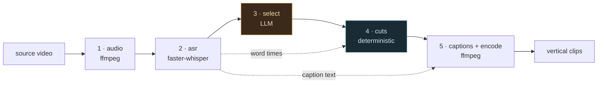
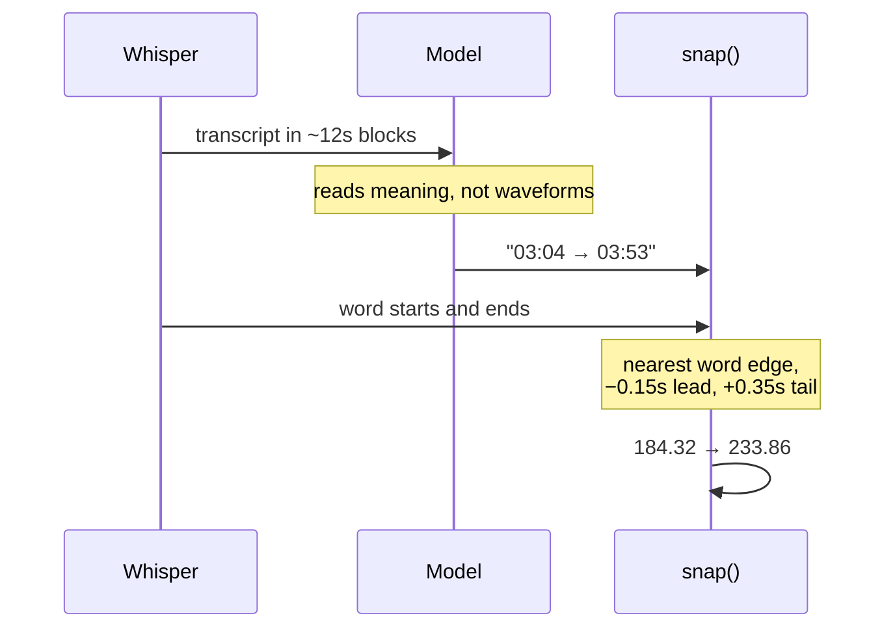
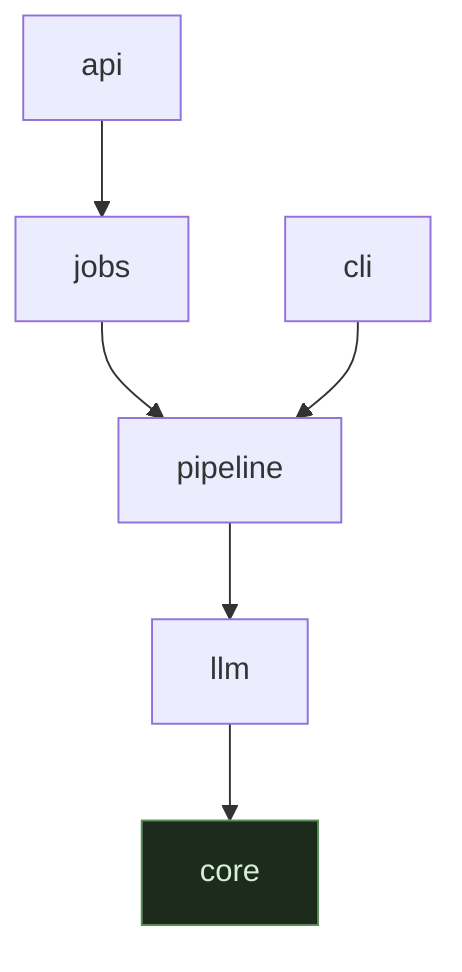
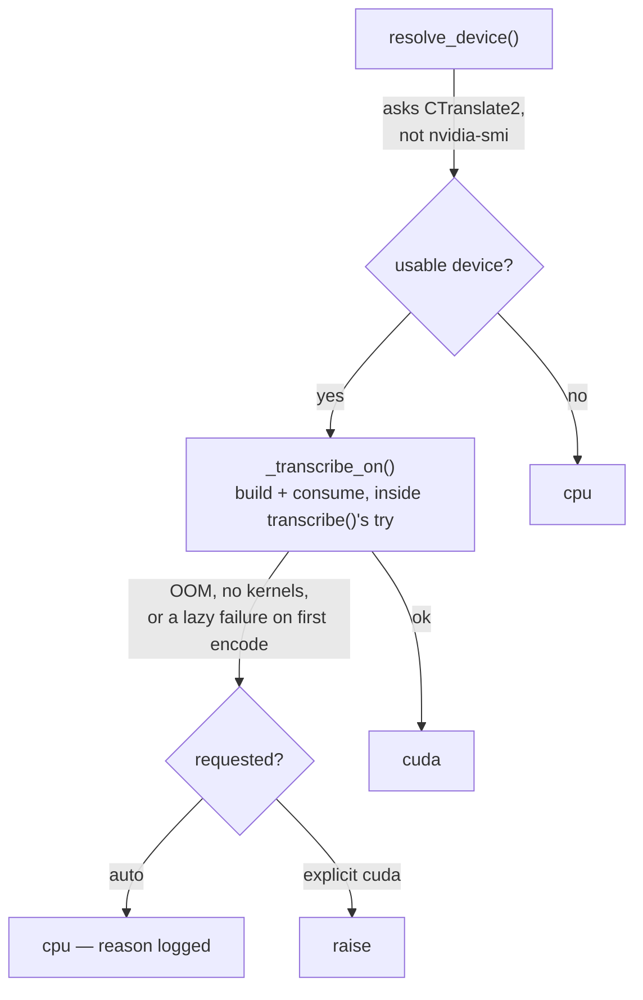
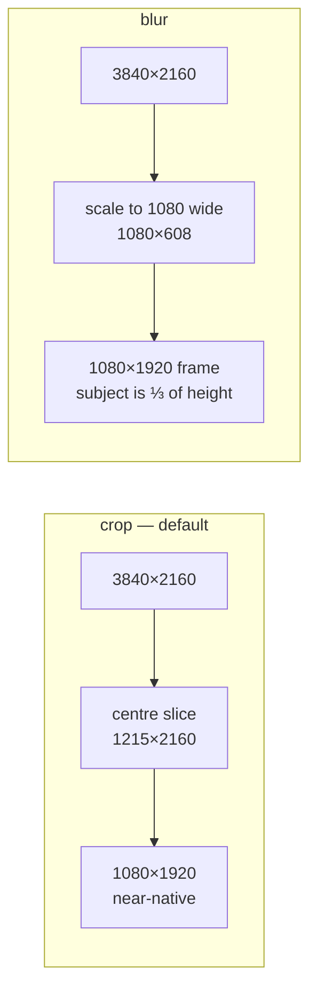
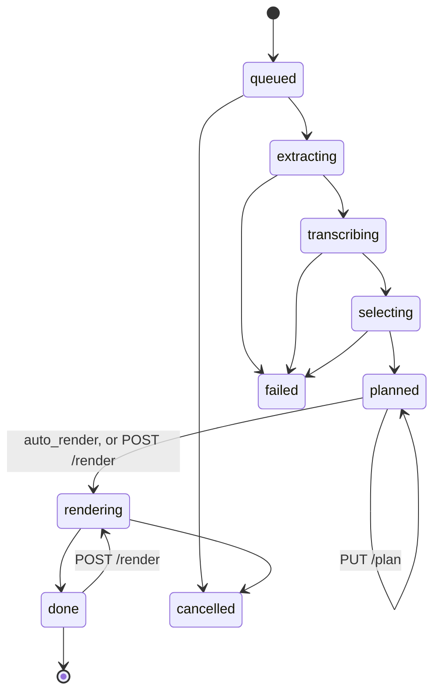

# Architecture

Five stages. Two of them touch a model. Keeping that boundary clean is the whole
design — everything else in this document follows from it.



| # | Module | Does | Model? | Deterministic? |
| --- | --- | --- | --- | --- |
| 1 | [`pipeline/audio.py`](../qatf-backend/qatf/pipeline/audio.py) | demux to 16 kHz mono wav, optionally denoised | no | yes |
| 2 | [`pipeline/asr.py`](../qatf-backend/qatf/pipeline/asr.py) | transcribe with word-level timings | Whisper | no |
| 2d | [`pipeline/health.py`](../qatf-backend/qatf/pipeline/health.py) | find decoder damage — repetition loops (blanked) and impossible word timings (reported, not corrected) | no | yes |
| 3 | [`pipeline/select.py`](../qatf-backend/qatf/pipeline/select.py) | pick which passages become clips | **your LLM** | no |
| 4 | [`pipeline/cuts.py`](../qatf-backend/qatf/pipeline/cuts.py) | snap cut points onto word boundaries | no | yes |
| 4b | [`pipeline/detect.py`](../qatf-backend/qatf/pipeline/detect.py) | find faces (`--reframe track` only) | YuNet | no |
| 4c | [`pipeline/framing.py`](../qatf-backend/qatf/pipeline/framing.py) | solve those into a crop path | no | yes |
| 5 | [`pipeline/captions.py`](../qatf-backend/qatf/pipeline/captions.py) + [`encode.py`](../qatf-backend/qatf/pipeline/encode.py) | ASS generation, reframe, burn, encode | no | yes |

Stage 4b is the third place a model runs and the only vision one. It is split
from 4c for the reason stage 3 is split from stage 4: *a face is here and that
one is talking* is a semantic claim, and turning it into geometry under limits
the detector never sees is not. Semantic in, geometric out, so stage 5 stays
model-free. If the framing lags or whips, the bug is in 4c; if the wrong person
is framed, it is in 4b. Diagnose them separately.

---

## The core invariant

> **The model never emits precise timing.**

Stage 3 sees the transcript in 12-second blocks (`BLOCK_SECONDS`, built by
`select.build_transcript_blocks`) and returns `MM:SS`. Stage 4 then moves those
onto real word start/end times measured by Whisper.



**Semantic boundaries come from the model. Acoustic boundaries come from the
audio. They are never mixed.**

If you are ever tempted to ask the model for millisecond timestamps, or to skip
`snap` because the numbers "look fine" — don't. The model will confabulate
sub-second values it has no way to know, and clips will open mid-syllable.

This applies to **hand-edited plans too**, which is why `PUT /jobs/{id}/plan` and
`--plan` re-snap by default. A human typing `"start": 20.0` is making the same
kind of semantic guess the model makes.

### The corollary you will use most

| Symptom | Stage | Where to look |
| --- | --- | --- |
| the clip is boring, or cuts an argument in half | 3 | the selection prompt |
| the clip opens mid-syllable, or clips a final consonant | 4 | word timings, then `snap` |

Diagnose them separately. They have never once been the same bug.

### Why snapping makes clips longer

`snap` moves the start to the nearest **word start** minus `SNAP_LEAD` (0.15s)
and the end to the nearest **word end** plus `SNAP_TAIL` (0.35s). Both move
outward. A clip the model sized at 58s routinely lands at 60–63s.

`within_duration` then drops anything that landed outside the request by more
than `DURATION_SLACK` (2 s). The margin is absolute rather than proportional
because what snapping adds is absolute — lead plus tail plus at most a word. The
old `lo * 0.6` to `hi * 1.4` scaled with the request and stopped meaning anything
at the top: `--max-len 52` admitted 72.8 s. Drops are logged.

`snap` is **idempotent**, and that is load-bearing rather than tidy: `--plan` and
`PUT /jobs/{id}/plan` re-snap by default, so the hand-edit round trip runs it
over its own output. It used to move the end onto the *next* word each pass —
`SNAP_TAIL` is 0.35 s while Arabic word ends measured ~0.45 s apart — so five
round trips grew one clip from 56.70 s to 59.21 s, silently. It also returns a
new `Clip` rather than rewriting the one it was given.

**Practical consequence:** ask for `--max-len 52` if you are targeting YouTube
Shorts' 60-second limit.

---

## Layering



```text
api  →  jobs  →  pipeline  →  llm  →  core
cli  ───────→   pipeline  →  llm  →  core
```

`core` imports nothing of ours. An import that points the other way is the signal
that something is **defined in the wrong package** — move the definition, don't
add the import.

The clearest example: `JobState` lives in [`jobs/model.py`](../qatf-backend/qatf/jobs/model.py),
not in [`api/schemas.py`](../qatf-backend/qatf/api/schemas.py), precisely because of that
arrow. The job lifecycle is a domain concept and `jobs` may not import from
`api`. It still serialises correctly in responses because it is a `str` Enum.

### One module per stage is not decoration

The core invariant is a rule about *what may cross a stage boundary*. File
boundaries make a violation visible in a diff. Stages 1, 4 and 5 import no model
client, and that is the property being protected — not tidiness.

### Import cost is deliberate too

`qatf.cli` pulls in neither pydantic nor fastapi; there is a check for this in
the smoke suite. `faster_whisper` and the provider SDKs are imported *inside* the
functions that use them, so:

- the CLI starts fast and works with no API extras installed
- `pip install -e ".[api,anthropic]"` does not drag in the OpenAI SDK
- generating the OpenAPI schema never loads a 3 GB model runtime

---

## Layout

Every module lives in a subpackage. Only `__init__.py` and `__main__.py` sit
loose at the package top level.

```text
qatf/
  core/            depends on nothing. imports no pipeline, no jobs, no HTTP
    config.py      Settings, read from the environment once
    constants.py   product decisions (9:16, caption budget, snap margins)
    db.py          the only module that imports sqlite3 — WAL, thread-local
                   connections, PRAGMA-versioned migrations
    dotenv.py      hand-rolled .env parser; the real environment always wins
    errors.py      QatfError hierarchy, each carrying its HTTP status
    types.py       Word, Transcript, Clip — plain dataclasses
    utils.py       subprocess, timestamps, slugs, logging
  pipeline/        the five stages, one module each. the ONLY pipeline logic
    audio.py       1.  demux                    ffmpeg
    asr.py         2.  transcribe + word times  faster-whisper
    fixups.py      2b. substitutions by value   text only, never timestamps
    edits.py       2c. corrections by position  text only, never timestamps
    health.py      2d. decoder-damage repair    blank a repetition loop, report a bad timing
    select.py      3.  pick clips               LLM
    cuts.py        4.  snap to word bounds      deterministic
    detect.py      4b. find faces               OpenCV, cached against the video
    framing.py     4c. solve the crop path      deterministic
    captions.py    5a. ASS generation           deterministic
    encode.py      5b. reframe + burn + encode  ffmpeg
  llm/             stage 3 providers — the only swappable part of the pipeline
    base.py        the contract: complete_json + declared Capabilities
    claude.py      Anthropic Messages API, official SDK
    openai_compat.py  everything speaking /v1/chat/completions
    presets.py     named endpoints: openai kimi glm ollama vllm openrouter
  jobs/            knows nothing about HTTP
    model.py       Job record, JobState, on-disk layout
    store.py       persistence, accessors, the thread pool
    worker.py      what a job actually runs
  api/             endpoints only
    __init__.py    create_app, the OpenAPI description
    deps.py        shared dependencies and the media-root boundary
    openapi.py     reusable failure declarations for the schema
    schemas.py     pydantic wire contract
    routers/       meta.py jobs.py plan.py outputs.py
  cli/
    parser.py      the argument surface
    runner.py      preflight + the run flow
qatf.py            legacy shim for `python qatf.py`
tests/             smoke_db.py, smoke_pipeline.py, smoke_llm.py, smoke_api.py,
                   _harness.py
```

The package directory **shadows the sibling `qatf.py`** on import — Python's path
finder checks directories before same-named modules — which is what stops the
legacy shim importing itself. Don't add a third `qatf.py` inside the package.

---

## Stage 2 — device selection

`--device auto` (the default) asks CTranslate2 how many CUDA devices it can use
and picks `cuda` if any, `cpu` otherwise. **Naming a device explicitly is honoured
and will not fall back** — asking for `cuda` and silently getting `cpu` turns a
benchmark into a lie.

Availability and usability are separate questions, so there are two layers:



- **`resolve_device()`** asks CTranslate2, not `nvidia-smi`. A card the installed
  CTranslate2 cannot target (compute capability, driver mismatch) is not a usable
  device, and only the engine knows that.
- **`transcribe()`** wraps the whole of `_transcribe_on` — construction AND
  consuming the segment generator — in a try/except, because a device can pass
  the availability check and still fail: OOM, a build with no kernels for that
  architecture, or faster-whisper's lazy initialisation, which builds the model
  happily on a GPU whose CUDA libraries are missing and only fails once decoding
  starts. A guard around construction alone (an earlier `load_model` helper,
  since removed — it had no production caller and could not see the lazy
  failures) cannot catch that; only wrapping the full call does.

The device actually used is recorded on the `Transcript`, echoed in the job record
and `GET /jobs/{id}`, and reported up front by `/healthz`. It is deliberately
**not** part of the transcript cache key: a CPU and a GPU transcript of the same
audio are interchangeable enough that re-transcribing after a fallback would be
waste.

---

## Stage 2 — the transcript cache

```text
<work>/qatf.db     transcripts table, one row per key
```

One database per work directory — `<out>/.work/qatf.db` for the CLI,
`$QATF_DATA_DIR/<job-id>/.work/qatf.db` for a job. Delete the row (or the whole
file) to re-transcribe; otherwise iterating on clip selection is free.

**In the key:** the Whisper size, the forced language, the hotword vocabulary and
the initial prompt — the same derivation the pre-SQLite filename used, via
`asr.cache_key`. Keying on the output directory alone silently reused an English
transcript after `--language ar`.

**Not in the key:** the device (see above), and both text-correction layers —
`fixups` and the per-word overlay (`word_edits`, also a table in the same
database). Those are applied *on read*, never baked in, so editing either never
orphans the cache and never changes a timestamp.

That separation is not just about cost. The row has to keep saying what Whisper
**actually produced**: the moment a corrected transcript is indistinguishable
from a raw one, every measurement in [quality.md](quality.md) stops meaning
anything. Moving the cache from a file to a database row changed nothing about
that — it is still written once, by `write_cache`, and never touched again by a
correction.

A pre-SQLite `words-<model>-<lang>.json` is imported into the database the first
time it is read and then left on disk, never deleted, so an upgrade stays
reversible by checking out the previous commit.

### Two text layers, deliberately

Both change `Word.text` and neither can touch `Word.start`/`Word.end`.

| | Keyed by | Fixes | Lives in |
| --- | --- | --- | --- |
| `fixups.py` | value | a term the decoder **always** mishears the same way | a text file you build up across videos |
| `edits.py` | position | a word misheard **once**, where the same string is correct elsewhere | the `word_edits` table in `<work>/qatf.db`, scoped by job id (API) or resolved output directory (CLI) |
| `health.py` | run of identical tokens | a decoder repetition loop — damage, not a mishearing, so there is no "correct" text to substitute; the run is blanked instead | nowhere — applied on read like the other two, but nothing is stored |

`health.py` is not really a third member of "two text layers" — it repairs
decoder damage rather than correcting a mishearing — but it obeys the same
rule the other two do (`Word.text` only, `Word.start`/`Word.end` untouched) and
runs in the same read path, `worker.baseline_words`: fixups first (a global
rule), then repair, then — for `caption_words` specifically — per-word edits
on top. It belongs in this table rather than a separate one.

The second exists because the first structurally cannot do it. On Egyptian
Arabic, Whisper writing `من` for `مين` is unfixable by substitution — `من` is one
of the most common words in the language and correct almost everywhere else it
appears.

Fixups run first, so a correction wins on the word it names.

`edits.diff()` is where the invariant is enforced: it refuses a submission that
changes the word count or any timing, so there is no code path — API, CLI or
hand-edited file — by which a caller can move a cut while claiming to fix a
spelling. Corrections record the text they replaced, so an overlay that no longer
lines up goes **stale** and is reported rather than landing on the wrong word.

---

## Stage 5 — reframe



On a 16:9 source, `blur` scales the whole frame to 1080 wide — a 3840×2160 source
becomes **1080×608** sitting in a 1920-tall frame, so the subject occupies a third
of the height at a fifth of its original resolution. `crop` takes a 1215×2160
centre slice and scales it to 1080×1920: nearly native, full frame.

Measured on the same clip at the same CRF, **crop carries 2.1× the bitrate** —
there is genuinely that much more detail to encode — and it renders faster, since
`blur` adds a full-frame gaussian. See
[quality.md](quality.md#render-performance).

`crop` is the default and is right for a centred talking head. Reach for `blur`
only when the framing genuinely needs the full width, and know what it costs.

A third mode, `track`, follows the subject: stage 4b samples face positions and
stage 4c solves them into a crop path that stage 5b drives with `sendcmd`. Both
static modes are untouched by it, deliberately — every number above was measured
against them.

---

## The job model



`auto_render: false` stops at `planned`. Everything from `planned` onwards costs
no model call and no re-transcription, which is what makes the hand-edit round
trip cheap.

### Three things it deliberately does not do

Given the dependency budget — a thread pool and job records as SQLite rows, no
broker and no cross-process job claiming — know these before promising
anything:

1. **Jobs do not survive a restart.** State persists, the worker does not. On
   startup anything left running is marked `failed: interrupted by a server
   restart`. That is honest, not a bug — but it is the first thing to fix if this
   ever runs behind a real deployment.
2. **Cancellation is cooperative.** The flag is checked between stages
   (`store.checkpoint`) and between clips (`should_stop`). It cannot interrupt an
   ffmpeg or Whisper call already in flight.
3. **`QATF_WORKERS` defaults to 1.** Two concurrent `large-v3` loads fight over
   the same GPU. Raise it only for CPU-bound render-only work.

### The media-root boundary

`media_root` is a security boundary, not a convenience: without it a `POST /jobs`
body naming `../../etc/passwd` would transcribe any file the process can read.
Absolute paths must still resolve inside it. Download names are resolved the same
way, inside the job's own output directory.

---

## Error handling

Every deliberate failure is a `QatfError` subclass carrying its own
`status_code`. A single exception handler in `create_app` maps it. Routers never
hand-map a domain failure to `HTTPException`, which is how HTTP concerns stay out
of the pipeline entirely.

A bare `RuntimeError` escaping the pipeline means something was not thought
through — the API surfaces it as a 500 rather than pretending it was a client
mistake.

---

## Open risks

In priority order. See [quality.md](quality.md) for what has been measured.

**1 · Arabic — shaping is answered, timing is not.** RTL rendering was broken and
is now fixed and verified (see
[troubleshooting.md](troubleshooting.md#the-rtl-caption-bug)). But Whisper's
*word timestamp accuracy* on Arabic feeds `snap` directly, so it degrades cut
quality and not just captions — and it is still unmeasured. Fonts are a live
hazard too: libass falls back silently, which is how you ship 50 clips in the
wrong typeface.

**2 · Tracking frames a face, not a speaker.** `--reframe track` exists and is
verified by [`tests/verify_render.py`](../qatf-backend/tests/verify_render.py), which renders
and measures where the subject landed. What is *not* built is the active-speaker
model: every detection reports `speaking=0.0`, so stage 4c always takes its
largest-face fallback and will frame the listener in a two-shot — on every tier,
including `best`. The tiers currently differ only in sample rate. Say so before
claiming multi-speaker support.

Untuned and unmeasured beyond that: every constant in the `TRACK_*` block of
`core/constants.py` is a starting value nobody has scored against real footage,
which is why none of them appears in [quality.md](quality.md). Deliberately still
behind selection quality — a perfectly tracked bad clip is still a bad clip.

**3 · Missing basics.** No loudness normalisation (`loudnorm` is a one-line filter
add and the highest value-per-effort item here), no silence trimming, no
scene-change detection.

Related and already visible: `slugify` is ASCII-only, so an all-Arabic title
produces `02-clip.mp4`. Fine while filenames are internal; not fine once a user
sees them.
